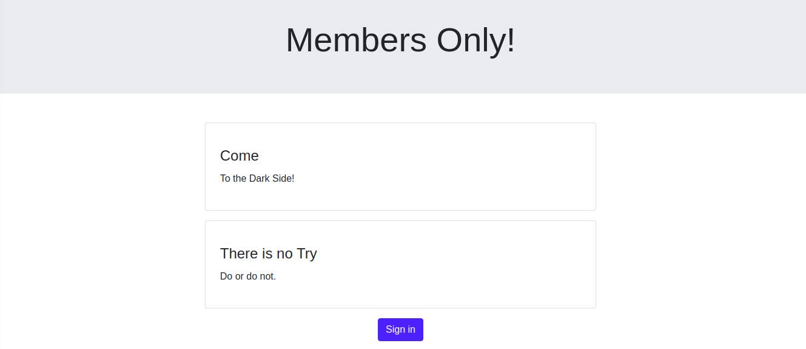
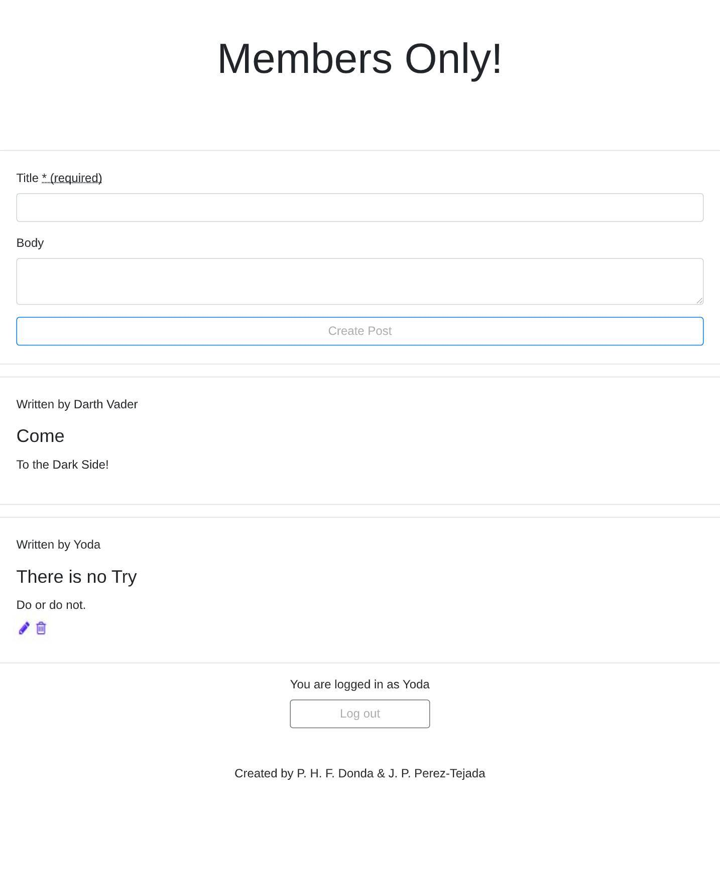

# Members Only!

## Description

This app is a Rails project for the Microverse's RoR curriculum, following TOP curriculum for webdevelopment. We have practiced the new knowledge about simple forms, Devise usage for authentication and much more.

## About the project

Are you a veteran gossiper? Do you want to talk about other people without repercussions? You do, don't you, you naughty? So become a member now! Only members can see what other members have said, so talk dirt about anyone else - as long as they are not members!

## Authorization

This project used Devise to require a registration in order to see the author of any post. What would be the fun of making someone miserable if they can't hear what is being said about them, right? (Disclaimer: We're not endorsing bullying, this is irony - we know it can be lost in written words =P) The app will track the session's authentication, so it will know if the user is a member or not, showing the text to everyone, but the authorship only for members.

## Screenshots

## Validations

New objects need to pass the following validations created authomatically by Devise - that is, a minimum 6 characters requirement for passwords.

## Built With

- [Ruby](https://www.ruby-lang.org/en/) 2.7.0 - A programming language.
- [Ruby on Rails](https://rubyonrails.org/) 6.0.3.1 - A Ruby framework for web development

## Getting started

### Prerequisites

- Ruby
- Rails
- Bundle
- Devise
- SQLite3. **Note**: You can change the database in GemFile.

### Installing

1. Download this repository

`$ git clone repo_url`

2. Install all required gem.

`$ bundle install`

3. Migrate the database.

`$ rails db:migrate`

### Running the tests

You can check specs into the folder 'tests'

## Authors

👤 **Pedro Donda**

- Github: [@Phfdonda](https://github.com/phfdonda)
- Twitter: [@srjuanpapas](https://twitter.com/phfdonda)
- Linkedin: [Pedro Donda](https://www.linkedin.com/in/pedro-donda-808621bb/)
- Contact: [E-mail](phfdonda@gmail.com)

👤 **Juan Paulo Perez Tejada**

- Github: [@Maclenn77](https://github.com/Maclenn77)
- Twitter: [@srjuanpapas](https://twitter.com/srjuanpapas)
- Linkedin: [Juan Paulo Perez Tejada](https://mx.linkedin.com/in/juanpaulopereztejada)

Visit [my blog](https://developerz.software/)

## License

This project is licensed under the MIT License - see the [LICENSE.md](LICENSE.md) file for details

## Acknowledgments

* Hat tip to anyone whose code was used
